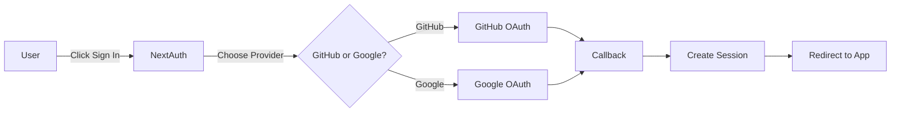

# 💬 Discuss – Modern Discussion Platform

<div align="center">


**A full-stack discussion platform built with modern web technologies**

[🔗 Live Demo](https://discuss-dusky.vercel.app) · [📖 Documentation](#-features) · [🚀 Quick Start](#-quick-start)

</div>

---

## 🌟 Overview

**Discuss** is a production-ready discussion platform where users can create topics, share posts, and engage in meaningful conversations. Built with Next.js App Router, Prisma, and PostgreSQL, it demonstrates real-world full-stack development practices.

---

## ✨ Features

### 🔐 **Authentication**
- 🔑 **GitHub OAuth** – Sign in with GitHub
- 🌐 **Google OAuth** – Sign in with Google
- 🛡️ Secure session management with NextAuth.js
- 🚪 Protected routes for authenticated users

### 📝 **Content Management**
- 📌 Create and browse discussion topics
- ✍️ Write and publish posts within topics
- 🗂️ Topic-based organization and navigation
- 🔍 Global search across all posts

### 💬 **Engagement**
- 💭 Comment on posts
- 🔗 Nested replies for threaded discussions
- ⚡ Real-time UI updates with cache revalidation
- 👥 User activity tracking

### 👤 **User Experience**
- 📊 Personal profile page
- 📜 View your post history
- 🎨 Clean, responsive design
- ♿ Accessible UI components

---

## 🛠️ Tech Stack

<table>
<tr>
<td valign="top" width="50%">

### Frontend
- ⚛️ **Next.js 16** (App Router)
- 🔷 **React 19**
- 📘 **TypeScript**
- 🎨 **Tailwind CSS**
- 🧩 **Radix UI**
- 🎯 **Lucide Icons**

</td>
<td valign="top" width="50%">

### Backend
- 🔧 **Next.js Server Components**
- 🔐 **NextAuth.js**
- 🗄️ **Prisma ORM**
- 🐘 **PostgreSQL** (Supabase)
- ☁️ **Vercel** (Deployment)

</td>
</tr>
</table>

---

## 🚀 Quick Start

### Prerequisites
- Node.js 18+ and npm
- PostgreSQL database (or Supabase account)
- GitHub OAuth App
- Google OAuth App

### 1️⃣ Clone Repository

```bash
git clone https://github.com/alokX01/discuss-nextjs.git
cd discuss-nextjs
npm install
```

### 2️⃣ Set Up OAuth Apps

#### **GitHub OAuth**
1. Go to [GitHub Developer Settings](https://github.com/settings/developers)
2. Click **New OAuth App**
3. Configure:
   - **Application name:** Discuss (Local)
   - **Homepage URL:** `http://localhost:3000`
   - **Callback URL:** `http://localhost:3000/api/auth/callback/github`
4. Copy **Client ID** and **Client Secret**

#### **Google OAuth**
1. Go to [Google Cloud Console](https://console.cloud.google.com/)
2. Create a new project or select existing
3. Navigate to **APIs & Services → Credentials**
4. Click **Create Credentials → OAuth 2.0 Client ID**
5. Configure OAuth consent screen if prompted
6. Set **Application type:** Web application
7. Add authorized redirect URI:
   - `http://localhost:3000/api/auth/callback/google`
8. Copy **Client ID** and **Client Secret**

### 3️⃣ Configure Environment Variables

Create a `.env` file in the root directory:

```env
# Database
DATABASE_URL="your_postgresql_pooling_url"
DIRECT_URL="your_direct_postgresql_url"

# GitHub OAuth
GITHUB_CLIENT_ID="your_github_client_id"
GITHUB_CLIENT_SECRET="your_github_client_secret"

# Google OAuth
GOOGLE_CLIENT_ID="your_google_client_id"
GOOGLE_CLIENT_SECRET="your_google_client_secret"

# NextAuth
AUTH_SECRET="your_random_secret_string"  # Generate with: openssl rand -base64 32
NEXTAUTH_URL="http://localhost:3000"
```

### 4️⃣ Set Up Database

```bash
# Push database schema
npx prisma db push

# (Optional) Open Prisma Studio to view data
npx prisma studio
```

### 5️⃣ Run Development Server

```bash
npm run dev
```

🎉 Open [http://localhost:3000](http://localhost:3000) in your browser!

---

## 📁 Project Structure

```
discuss-app/
├── app/                    # Next.js App Router
│   ├── topic/             # Topic pages
│   ├── profile/           # User profile
│   ├── api/auth/          # NextAuth API routes
│   └── page.tsx           # Home page
├── components/            # React components
│   ├── topics/           
│   ├── posts/            
│   ├── comments/         
│   └── header.tsx        
├── db/                    # Database client
├── actions/               # Server actions
├── prisma/               # Database schema
│   └── schema.prisma     
└── public/               # Static assets
```

---

## 🎨 Design Philosophy

> **Simple. Readable. Scalable.**

- 🧩 **Component-Driven** – Reusable, modular components
- 📐 **Consistent Design** – Unified spacing, typography, and colors
- 📱 **Responsive First** – Mobile to desktop optimization
- ♿ **Accessibility** – WCAG compliant components
- 🎯 **Content-Focused** – Minimal distractions, maximum readability

---

## 🔒 Authentication Flow



---

## 🚢 Deployment

### Deploy to Vercel

[](https://vercel.com/new/clone?repository-url=https://github.com/alokX01/discuss-nextjs)

1. Click the button above
2. Connect your GitHub repository
3. Add environment variables in Vercel dashboard
4. Deploy!

### Environment Variables for Production

Update callback URLs in OAuth apps:
- **GitHub:** `https://your-domain.vercel.app/api/auth/callback/github`
- **Google:** `https://your-domain.vercel.app/api/auth/callback/google`

Update `.env`:
```env
NEXTAUTH_URL="https://your-domain.vercel.app"
```

---

## 📚 Key Features Breakdown

### 🔐 Dual OAuth Authentication
```typescript
// Supports both GitHub and Google sign-in
// Secure session management
// Automatic user profile creation
```

### 🧵 Topic-Based Discussions
```typescript
// Organized conversations by topics
// Easy navigation and discovery
// SEO-friendly dynamic routes
```

### 💬 Nested Comment System
```typescript
// Threaded discussions
// Reply to specific comments
// Real-time cache updates
```

---

## 🤝 Contributing

Contributions are welcome! Please follow these steps:

1. Fork the repository
2. Create a feature branch (`git checkout -b feature/amazing-feature`)
3. Commit your changes (`git commit -m 'Add amazing feature'`)
4. Push to the branch (`git push origin feature/amazing-feature`)
5. Open a Pull Request

---

## 📄 License

This project is licensed under the MIT License - see the [LICENSE](LICENSE) file for details.

---

## 👨‍💻 Author

**Alok Kumar**

- GitHub: [@alokX01](https://github.com/alokX01)
- Project Link: [https://github.com/alokX01/discuss-nextjs](https://github.com/alokX01/discuss-nextjs)

---

## 🙏 Acknowledgments

- [Next.js](https://nextjs.org/) - The React Framework
- [Prisma](https://www.prisma.io/) - Next-generation ORM
- [NextAuth.js](https://next-auth.js.org/) - Authentication for Next.js
- [Vercel](https://vercel.com/) - Deployment Platform
- [Supabase](https://supabase.com/) - PostgreSQL Database

---

<div align="center">

**⭐ Star this repo if you find it helpful!**

Made with ❤️ using Next.js

</div>
